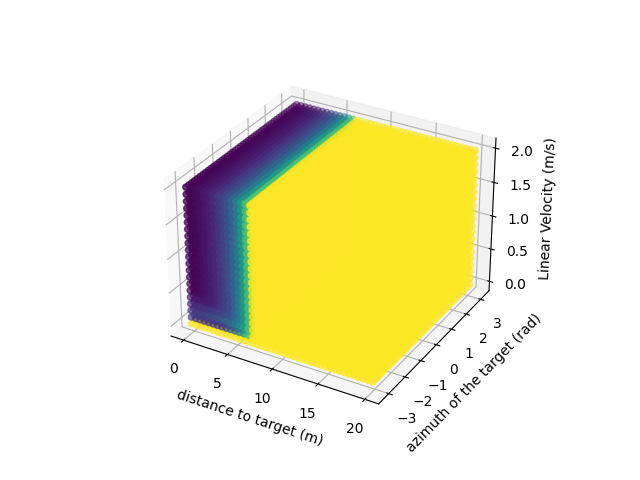
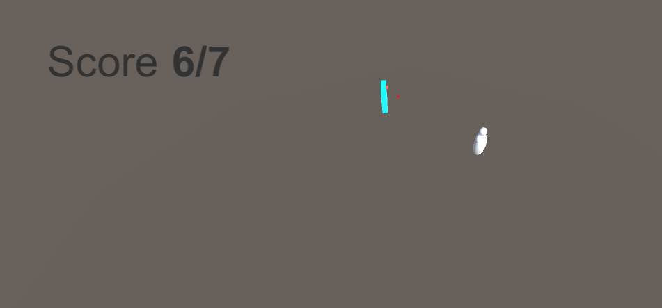

# FuzzyNeuralInteractiveAgent

Learning of a reactive behavior using a neural network and a fuzzy logic controller. 

## Requirements

* Python = 3.9.7
* Tensorflow = 2.7.0
* Java jdk = 17.0.1
* JFuzzyLogic (To be present in ```./```)

## Fuzzy Logic Controller

### Compiling the fuzzyStateEstimator\FuzzyStateEstimator.java code

To be able to create the fuzzy model, the Java file FuzzyStateEstimator.java needs to be compiled using the command:
``` javac -classpath "jFuzzyLogic.jar" fuzzyStateEstimator\FuzzyStateEstimator.java```

### Modifying the fuzzy logic controller

To edit the fuzzy logic model modify the following file:
``` data/coolAngryModel.fcl```

### Generate controller lookup table

After editing the fcl file, a model lookup table will be generate using the command:
``` javac -classpath "jFuzzyLogic.jar" fuzzyStateEstimator\FuzzyStateEstimator.java ```

The generated lookup table will have the same path and name as the fcl file (In our case ``` data/coolAngryModel.csv ``` )

### Evaluete FLC model

To evaluate the created model using its lookup table, run the following code
``` python fuzzyStateEstimator/plotData data/coolAngryModel.csv ```

The plotted 4D scatter diagram shows all the input variables as the 3 standard axes and the output (mood) is represented as the color of each point.
The color yellow represents the state cool while the color purple represents the state angry.
The graph is also saved as a png with the same path as the fcl file.



## Python neural network

### Generating the dataset

A dataset must be generated from unity by using the Logger object with the activated ``` AgentTransformLogger.cs ``` component.
The agent must have the ``` KBVelocityController.cs ``` component active to allow user control using the arrow keys.
The generated log is saved ```fuzzy-neural-interactive-agent/Assets/Logs

The dateset can then be prepard for learning using the command:
 ``` python behaviorNeuralLearning/prepareDataset.py <Path to log file>/<log file>.csv learningData/dataset.csv ```

 where dataset.csv is the name of the dataset we want to prepare from the log file.

 The dataset can be split into 3 (training, testing, and validation) using the command:
 ``` python behaviorNeuralLearning/splitDataset.py leaningData/dataset.csv ```

 ### Training the neural network

 Modifying the neural network model can be done by modifying the file ``` behaviorNeuralLearning/learnBehaviour.py```
 The model currently used has 3 hidden layer with 10, 20, and 10 neurons respectively.
 The hidden layer activation functions are tanh while the output layer is linear.
 The model is trained for 300 epochs.

 To train the model, excute the command:
``` python behaviorNeuralLearning/learnBehaviour.py learningData dataset ```
~[Trainging](learningData\Strategy2\mlp_tanh_linear_10x20x10_2021-12-12-16-57-37_loss.png)
To evaluate the trained model, use the command:
``` behaviorNeuralLearning/evaluateModel.py learningData dataset <generated model name> ```


### Deploying the finished model

In the Unity project, make sure that the agent has the ``` AgentRemoteController.cs ``` component active and the ``` KBVelocityController.cs ``` deactivated.

Run the command:
``` python behaviorNeuralLearning/remoteAgentController.py -m <Path to neural model>/<neural model name>.h5 ```

The code will automatically use the lookup table ``` data/coolAngryModel.csv ``` (temporary solution)

When the python code is waiting for data, run the Unity simulation.

The agent should be go toward the target if it is calm, and run away if it is angry.
